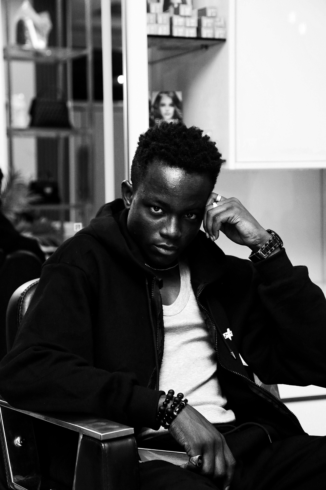

# ATP Kolokvij

## Kratki opis

Dalí je u povijesti zapamćen po svojim snažnim i bizarnim slikama te kao jedan od najpoznatijih predstavnika nadrealizma u slikarstvu, a mnogi stručnjaci smatraju da su na njegov stil utjecali renesansni majstori. Među njegovim opusom najpoznatija je slika Postojanost pamćenja (Mekani satovi) dovršena 1931. koja je, osim po svojoj umjetničkoj vrijednosti, poznata po tome što je korištena u mnogim igranim i animiranim filmovima.

<?xml version="1.0" encoding="utf-8"?>
<fileSnapshot xmlns:xsd="http://www.w3.org/2001/XMLSchema" xmlns:xsi="http://www.w3.org/2001/XMLSchema-instance">
  <files>
    <file path="C:\ProgramData\chocolatey\lib\nerd-fonts-Recursive\FontFilesInstalled.log" checksum="32D324B1A8CDE7BB535B4C4D5357EA7D" />
    <file path="C:\ProgramData\chocolatey\lib\nerd-fonts-Recursive\nerd-fonts-Recursive.nupkg" checksum="67CB0D28E246CED8FD5E6A81269FCFA8" />
    <file path="C:\ProgramData\chocolatey\lib\nerd-fonts-Recursive\nerd-fonts-recursive.nuspec" checksum="712FE1DFF07E4F3640B53BDC81244533" />
    <file path="C:\ProgramData\chocolatey\lib\nerd-fonts-Recursive\Recursive.zip.txt" checksum="57B8293869264868D18FA932B2E2E215" />
    <file path="C:\ProgramData\chocolatey\lib\nerd-fonts-Recursive\tools\chocolateyInstall.ps1" checksum="041E79490F46DE34CF37E8C5AA152AF6" />
    <file path="C:\ProgramData\chocolatey\lib\nerd-fonts-Recursive\tools\chocolateyUninstall.ps1" checksum="F0C578ADAB9D24FD8243109E60D5EE44" />
    <fil

[link slike](https://www.pexels.com/photo/stylish-portrait-of-young-man-in-hair-salon-29640451/)
[link teksta](https://hr.wikipedia.org/wiki/Glavna_stranica)

1. popis
2. da
3. ne

- da
- ne
- neznam

naziv | verzija | autor |
------|---------|-------|
sta   | je      |   ovo |

Naslov projekta (H1) – Dodajte naslov "ATP Kolokvij".
Kratki opis projekta (H2) – Preuzmite tekst od 2-3 rečenice s Wikipedije.
Slika – Preuzmite sliku s Pexels i umetnite je u dokumentaciju.
Primjer koda – Preuzmite mali isječak koda s Gists i dodajte ga kao kodni blok.
Linkovi – Dodajte linkove na izvore slike i teksta koje ste koristili. 
Popis – Napravite jedan numerički i jedan ne-numerički popis vezan za projekt.
Tablica – Izradite kratku tablicu koja sadrži informacije o projektu (npr. naziv, verzija, autor).

